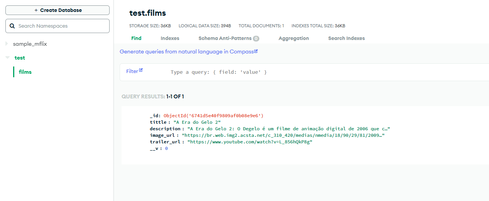

# Films API

API para gerenciamento de filmes construída com Node.js, Express, Mongoose (MongoDB) e Swagger para documentação.

## Descrição

Esta API permite adicionar, atualizar, deletar e listar filmes. É uma aplicação backend construída com as melhores práticas, onde os filmes são armazenados em um banco de dados MongoDB. A API utiliza o Mongoose para a interação com o banco de dados e o Swagger para a documentação da API.

A API foi construída com base em algumas ideias do Gabriel Rangel, cujo tutorial pode ser encontrado [aqui](https://www.youtube.com/watch?v=zaWFnHagbrM).

## Funcionalidades

- **POST** `/film`: Adiciona um novo filme ao banco de dados.
- **GET** `/films`: Retorna todos os filmes cadastrados.
- **PUT** `/{id}`: Atualiza as informações de um filme específico.
- **DELETE** `/{id}`: Deleta um filme com base no seu ID.

## Tecnologias Utilizadas

- **Node.js**: Plataforma para a execução do JavaScript no lado do servidor.
- **Express.js**: Framework para construção da API.
- **Mongoose**: ODM (Object Data Modeling) para MongoDB e Node.js.
- **MongoDB**: Banco de dados NoSQL usado para armazenar os filmes.
- **Swagger**: Ferramenta para documentar a API de forma interativa.

### Imagem da Estrutura de Dados no Banco

Aqui está uma representação visual dos dados de um filme no banco de dados:

> **Observação**: A imagem acima mostra a estrutura dos dados de um filme no MongoDB. Você pode visualizar seus dados usando ferramentas como o [MongoDB Compass](https://www.mongodb.com/products/compass) ou executar uma consulta para visualizar os documentos armazenados.

## Como Rodar

### Pré-requisitos

- Node.js (recomenda-se a versão LTS)
- MongoDB (local ou remoto)

